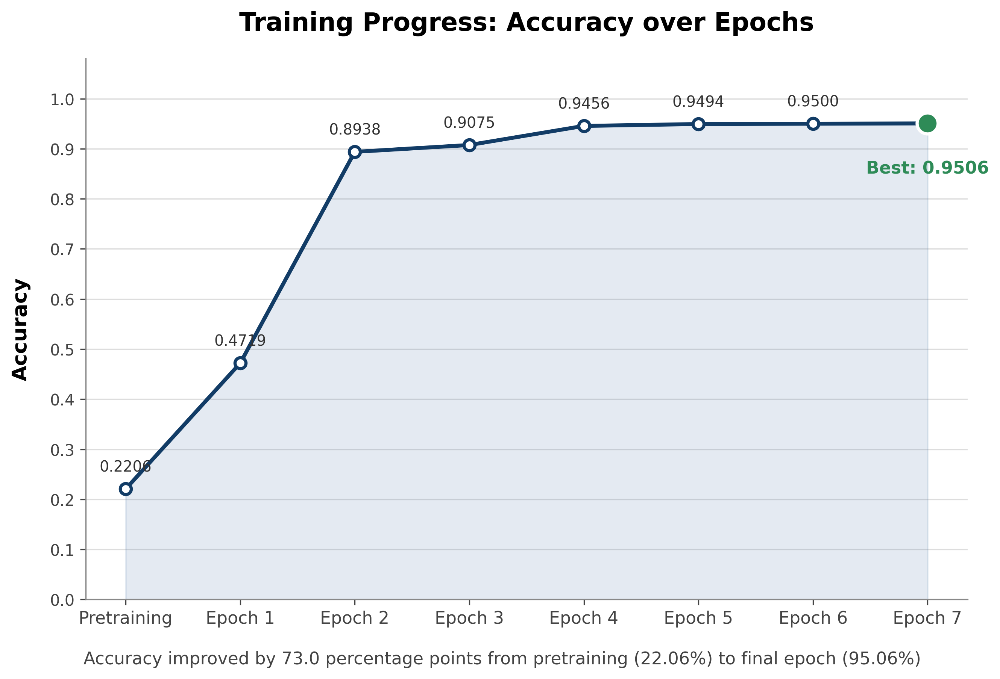
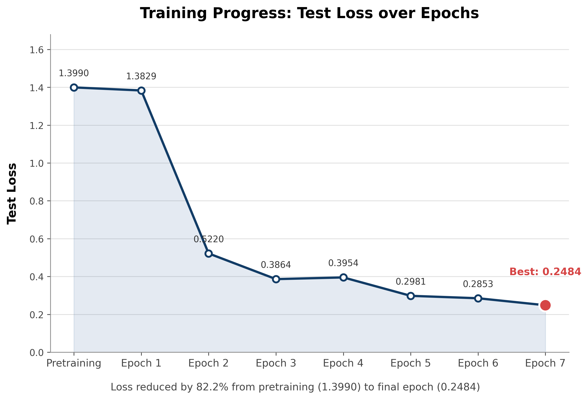
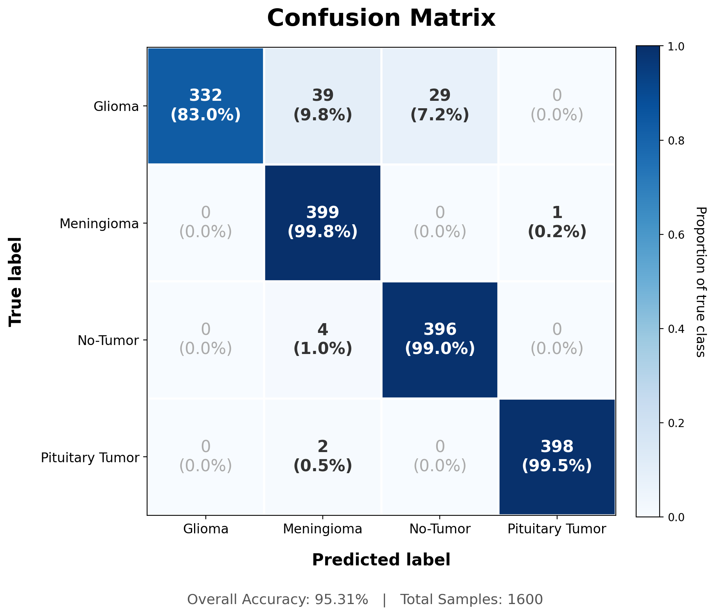

# Brain Tumor Detection

A student-built brain MRI classification system that combines a
fine-tuned **ResNet-50** computer vision model with a **Gemini-powered
conversational assistant**, exposed through a web application and
FastAPI backend.

> **⚠️ Medical Disclaimer**
>
> This project is an educational/student project and **is not a medical
> device, diagnostic system, or clinically validated tool**. Its
> predictions may be incorrect and must not be used for diagnosis,
> treatment decisions, or other clinical purposes. The reported
> performance reflects evaluation on the datasets used in this project
> and does not establish clinical reliability.

------------------------------------------------------------------------

## Table of Contents

-   [Overview](#overview)
-   [Features](#features)
-   [System Workflow](#system-workflow)
-   [Model](#model)
-   [Dataset](#dataset)
-   [Performance](#performance)
-   [Confusion Matrix](#confusion-matrix)
-   [Training Behavior](#training-behavior)
-   [AI Explanation & Conversation](#ai-explanation--conversation)
-   [Backend & Security](#backend--security)
-   [Redis](#redis)
-   [Project Structure](#project-structure)
-   [Technology Stack](#technology-stack)
-   [Installation & Usage](#installation--usage)
-   [Limitations](#limitations)
-   [Future Improvements](#future-improvements)
-   [License](#license)

------------------------------------------------------------------------

## Overview

The goal of this project was to explore whether a practical end-to-end
brain MRI classification application could be built using a pretrained
computer vision model, while also learning how to connect a machine
learning model to a real web backend and an LLM-powered conversational
interface.

The core classifier is a **pretrained ResNet-50 model from
torchvision**, fine-tuned on the **Masoud NickParvar Brain MRI Dataset**
to classify MRI images into four categories:

-   Glioma
-   Meningioma
-   No Tumor
-   Pituitary Tumor

The best checkpoint achieved **95.31% accuracy on a 1,600-image
evaluation set**, correctly classifying 1,525 images. An additional
evaluation on a separate dataset obtained approximately **94%
accuracy**, providing an additional, though limited, check of robustness
outside the primary dataset.

The classifier is then integrated with a Gemini model. Rather than
simply returning a class label, the application passes the model's
prediction probabilities to the LLM, which explains the result to the
user and supports follow-up questions about the prediction.

The project also includes a backend security layer designed for a
public-facing application without user accounts. This includes IP-based
rate limiting, session expiration, file validation, antivirus scanning,
and size limits.

------------------------------------------------------------------------

## Features

### 🧠 MRI Classification

-   Fine-tuned ResNet-50 image classifier
-   Four-class brain MRI classification
-   Probability distribution across all classes
-   Saved best-performing model checkpoint
-   Evaluation using accuracy, precision, recall, F1-score, AUC-ROC, and
    confusion matrix

### 💬 AI-Powered Explanation

-   Gemini receives the classifier's prediction and probability
    distribution
-   Generates a natural-language explanation of the classification
-   Supports follow-up questions
-   Maintains conversation context during an active session

### 🌐 Web Application

-   Image upload through a web frontend
-   FastAPI backend
-   Session-based interaction without requiring user registration
-   Prediction and AI explanation returned to the frontend

### 🔐 Backend Security

Because the application does not require users to create accounts,
several safeguards were implemented:

-   IP-based rate limiting
-   Temporary session IDs
-   Session expiration
-   Uploaded-file validation
-   Image verification
-   File-size limits
-   Message-size limits
-   Antivirus scanning
-   Input validation before processing

These mechanisms are intended to make the student application safer to
expose as a web service; they should not be interpreted as a complete
production security architecture.

------------------------------------------------------------------------

## System Workflow

The application follows this general pipeline:

``` text
                    ┌──────────────────┐
                    │      User        │
                    │  Uploads MRI     │
                    └────────┬─────────┘
                             │
                             ▼
                    ┌──────────────────┐
                    │    Frontend      │
                    │   index.html     │
                    └────────┬─────────┘
                             │
                             │ Image upload
                             ▼
                    ┌──────────────────┐
                    │    FastAPI       │
                    │     Backend      │
                    └────────┬─────────┘
                             │
                    Validation & Security
                             │
                             ▼
                    ┌──────────────────┐
                    │   ResNet-50      │
                    │   Classifier     │
                    └────────┬─────────┘
                             │
                   Class probabilities
                             │
                             ▼
                    ┌──────────────────┐
                    │      Gemini      │
                    │   Explanation    │
                    └────────┬─────────┘
                             │
                             ▼
                    ┌──────────────────┐
                    │     Redis        │
                    │ Session History  │
                    └────────┬─────────┘
                             │
                             ▼
                    ┌──────────────────┐
                    │    Frontend      │
                    │ Result + Chat    │
                    └──────────────────┘
```

### Initial request

1.  The user uploads an image through the frontend.
2.  The frontend sends the file to the backend's session-initiation
    endpoint.
3.  The backend validates the request and uploaded file.
4.  Rate limits and security checks are applied.
5.  The MRI image is passed to the ResNet-50 classifier.
6.  The classifier produces probabilities for all four classes.
7.  Those probabilities are provided to Gemini together with an
    initialization prompt.
8.  Gemini generates an explanation of the prediction.
9.  A unique session ID is generated.
10. The conversation is stored temporarily in Redis.
11. The session ID and initial response are returned to the frontend.

### Follow-up messages

When the user asks another question:

1.  The frontend sends the message together with the session ID.
2.  The backend validates the message and applies rate limits.
3.  The existing conversation is retrieved from Redis.
4.  The new message is added to the conversation.
5.  Gemini generates a response using the conversation context.
6.  The updated conversation is stored back in Redis.
7.  The response is returned to the frontend.

If a session expires or an error occurs, the backend handles the failure
instead of assuming that the conversation still exists.

------------------------------------------------------------------------

## Model

### Architecture

The classifier is based on **ResNet-50**, initialized with pretrained
weights from `torchvision`.

The original classification head was replaced with a new fully connected
layer for the four target classes.

``` text
Pretrained ResNet-50
        │
        ▼
Fine-tuning on Brain MRI Dataset
        │
        ▼
4-class classification head
        │
        ├── Glioma
        ├── Meningioma
        ├── No Tumor
        └── Pituitary Tumor
```

Using a pretrained model allowed the project to take advantage of visual
representations learned from large-scale image data while adapting the
final model to the MRI classification task.

### Data augmentation

The training pipeline included image transformations such as:

-   Resize to 224 × 224
-   Random horizontal flipping
-   Random rotation
-   Random affine translation

These transformations were used to introduce variation during training
and reduce dependence on the exact appearance and positioning of
individual training images.

------------------------------------------------------------------------

## Dataset

The primary dataset is the **Masoud NickParvar Brain MRI Dataset**.

The project used four classes:

  Class   Label
  ------- -----------------
  0       Glioma
  1       Meningioma
  2       No Tumor
  3       Pituitary Tumor

The primary evaluation set contains **400 images per class**, for a
total of **1,600 images**.

The project also evaluated the model on a separate external dataset
obtained from a hospital-related dataset available online. That
evaluation achieved approximately **94% accuracy**.

### Dataset caveat

Dataset-level evaluation does not automatically guarantee patient-level
independence. Although the project attempted to avoid duplicate samples
and the dataset documentation indicated no duplication, **patient-level
duplication or leakage cannot be ruled out with absolute certainty**.

Therefore, the reported results should be interpreted as evidence of
model performance on the evaluated datasets, rather than evidence of
clinical generalization.

------------------------------------------------------------------------

## Performance

The best saved checkpoint was obtained at **Epoch 5**.

 | Metric               |               Score |
 | -------------------- | ------------------- |
 | Validation Loss      |          **0.2902** |
 | Accuracy             |          **95.31%** |
 | Correct Predictions  |   **1,525 / 1,600** |
 | Macro Precision      |          **0.9570** |
 | Macro Recall         |          **0.9531** |
 | Macro F1-Score       |          **0.9522** |
 | Macro AUC-ROC        |          **0.9906** |

The close agreement between macro precision, recall, and F1-score
indicates relatively consistent performance across the four classes.

The macro AUC-ROC of **0.9906** also indicates strong class separation
on this evaluation dataset based on the predicted probabilities.

### Per-class performance

  Class                Precision       Recall     F1-Score   Samples
  ----------------- ------------ ------------ ------------ ---------
  Glioma              **1.0000**       0.8300       0.9071       400
  Meningioma              0.8986   **0.9975**       0.9455       400
  No Tumor                0.9318   **0.9900**       0.9600       400
  Pituitary Tumor     **0.9975**   **0.9950**   **0.9962**       400

### Main observation

The model's main weakness is **Glioma recall**.

It correctly identifies 332 of the 400 Glioma images, but 68 are
classified as other categories:

-   39 → Meningioma
-   29 → No Tumor

This means the model is extremely precise when it predicts Glioma, but
it misses a meaningful portion of the actual Glioma samples.

The strongest class is **Pituitary Tumor**, with an F1-score of
**99.62%**.

------------------------------------------------------------------------

## Training Progress



The model improved rapidly during fine-tuning:

  Stage             Accuracy
  ------------- ------------
  Pretraining         33.44%
  Epoch 1             91.63%
  Epoch 2             93.13%
  Epoch 3             94.13%
  Epoch 4             94.63%
  **Epoch 5**     **95.31%**
  Epoch 6             94.94%
  Epoch 7             94.63%

The best checkpoint was therefore selected from **Epoch 5** rather than
simply using the final epoch.

------------------------------------------------------------------------

## Validation Loss



Validation loss decreased substantially during the first part of
training:

  Stage           Validation Loss
  ------------- -----------------
  Pretraining              1.4374
  Epoch 1                  0.3598
  Epoch 2                  0.3399
  Epoch 3                  0.3210
  Epoch 4                  0.3106
  **Epoch 5**          **0.2902**
  Epoch 6                  0.3652
  Epoch 7                  0.3611

After Epoch 5, validation loss increased even though training continued.
This behavior is consistent with the onset of **overfitting**, which was
another reason for keeping the Epoch 5 checkpoint.

------------------------------------------------------------------------

## Confusion Matrix



The confusion matrix for the 1,600-image evaluation set is:

``` text
                 Predicted
               C0    C1    C2    C3
Actual C0    332    39    29     0
Actual C1      0   399     0     1
Actual C2      0     4   396     0
Actual C3      0     2     0   398
```

The majority of predictions are on the diagonal.

The dominant error pattern is:

> **Glioma → Meningioma / No Tumor**

In contrast, Meningioma, No Tumor, and especially Pituitary Tumor show
very high recall on this evaluation set.

------------------------------------------------------------------------

## AI Explanation & Conversation

The classifier is not used in isolation.

After inference, the application passes the classification result and
probability distribution to a Gemini model.

For example, conceptually, the information supplied to the LLM includes:

``` text
Predicted class:
Glioma

Class probabilities:
Glioma: ...
Meningioma: ...
No Tumor: ...
Pituitary Tumor: ...
```

Gemini then acts as the conversational explanation layer.

The user can:

-   Ask what the predicted class means
-   Ask for clarification about the probabilities
-   Ask questions about the prediction
-   Ask about the reliability of the result
-   Continue the conversation without uploading the image again during
    the active session

The LLM is therefore **not replacing the image classifier**. The
ResNet-50 model performs the image classification, while Gemini is
responsible for explaining the model output and maintaining the
conversational interaction.

The application is also designed to make the distinction between an
educational model prediction and a clinical diagnosis clear to the user.

------------------------------------------------------------------------

## Backend & Security

The backend is implemented with **FastAPI**.

Since the application does not require user accounts, additional
mechanisms were implemented to control access and prevent sessions from
remaining indefinitely active.

### Rate limiting

Rate limiting is performed per IP address using Redis.

Conceptually:

``` text
Rate:{host} → request count
```

The counter is used to restrict excessive requests from the same host.

### Session management

Each new analysis receives a unique session ID.

The conversation is stored using a Redis key of the form:

``` text
Conv:{id}
```

The value contains the conversation history used to maintain context
between requests.

Sessions are temporary and expire after a defined period.

### Input validation

The backend validates uploaded files before processing them, including
checks related to:

-   File type
-   Image validity
-   File size
-   Antivirus scanning

Text messages are also subject to validation and size limits.

These checks are particularly important for a public upload endpoint
because the backend should not blindly trust data received from the
browser.

------------------------------------------------------------------------

## Redis

Redis is used as the temporary data store for two main purposes:

### 1. Rate limiting

``` text
Rate:{host}
```

Stores the request counter associated with a client host.

### 2. Conversation sessions

``` text
Conv:{id}
```

Stores the conversation history associated with a generated session ID.

This makes Redis a good fit for the application's temporary state
because the information does not need to become a permanent user
database.

------------------------------------------------------------------------

## Project Structure

``` text
BrainTumorDetection/
│
├── .venv/
│
├── data/
│   └── Masoud Nickparvar Dataset/
│       ├── train/
│       └── test/
│
├── src/
│   ├── data.py
│   ├── gemini.py
│   ├── invoke.py
│   ├── main.py
│   ├── model.py
│   ├── prompt.py
│   └── train.py
│
├── results/
│   ├── AccuracyGraph.png
│   ├── LossGraph.png
│   ├── Performance.md
│   ├── ConfusionMatrix.png
│   └── Model.pth
│
├── static/
│   └── index.html
│
├── notebooks/
│   └── BrainTumorDetection.ipynb
│
├── .env
├── requirements.txt
├── README.md
├── LICENSE
└── .gitignore
```

### Main components

  ---------------------------------------------------------------------------
  File                                    Purpose
  --------------------------------------- -----------------------------------
  `src/data.py`                           Dataset and data-processing
                                          functionality

  `src/model.py`                          ResNet-50 model definition

  `src/train.py`                          Model training

  `src/invoke.py`                         Model inference

  `src/gemini.py`                         Gemini integration

  `src/prompt.py`                         LLM prompting logic

  `src/main.py`                           FastAPI backend and application
                                          endpoints

  `static/index.html`                     Web frontend

  `notebooks/BrainTumorDetection.ipynb`   Development and experimentation
                                          notebook

  `results/Model.pth`                     Saved model checkpoint

  `results/Performance.md`                Detailed performance analysis
  ---------------------------------------------------------------------------

------------------------------------------------------------------------

## Technology Stack

### Machine Learning

-   Python
-   PyTorch
-   Torchvision
-   ResNet-50
-   NumPy
-   PIL

### Backend

-   FastAPI
-   Python
-   Redis

### AI

-   Gemini API

### Frontend

-   HTML
-   JavaScript
-   CSS

### Development

-   Jupyter Notebook
-   PyCharm
-   Git / GitHub

------------------------------------------------------------------------

## Installation & Usage

### 1. Clone the repository

``` bash
git clone https://github.com/EngOmar-Ai/BrainTumorDetection.git
cd BrainTumorDetection
```

### 2. Create a virtual environment

``` bash
python -m venv .venv
```

Activate it according to your operating system.

### 3. Install dependencies

``` bash
pip install -r requirements.txt
```

### 4. Configure environment variables

Create/configure the project's `.env` file with the credentials and
configuration required by the application.

**Do not commit real API keys, passwords, or other secrets to GitHub.**

### 5. Configure Redis

The application requires a Redis instance for temporary rate-limit and
conversation-session storage.

Make sure Redis is running before starting the backend.

### 6. Start the application

Start the FastAPI application using the entry point defined in:

``` text
src/main.py
```

The exact command may depend on the environment and how the FastAPI
application object is exposed.

------------------------------------------------------------------------

## Limitations

This project deliberately does **not** claim clinical reliability.

### 1. Dataset limitations

The reported 95.31% performance is based on a specific evaluation
dataset. Strong performance on a curated dataset does not necessarily
translate to performance on real clinical data.

### 2. Patient-level leakage cannot be completely ruled out

The project attempted to avoid duplication, and the dataset
documentation indicated no duplication. However, the project cannot
provide absolute proof that no patient-level overlap exists.

### 3. Limited external validation

A second, independent dataset was used as an additional robustness check
and produced approximately 94% accuracy. This is encouraging, but it is
not equivalent to a large, rigorously controlled multi-center clinical
validation study.

### 4. Class-specific weaknesses

The largest weakness is Glioma recall, which was **83%** on the primary
evaluation set.

A model can therefore produce a confident-looking prediction while still
being wrong.

### 5. Dataset shift

MRI appearance can vary substantially depending on:

-   Scanner hardware
-   Imaging protocols
-   Acquisition settings
-   Patient population
-   Institution
-   Image preprocessing

A model trained on one collection of images may therefore behave
differently on another population or imaging environment.

### 6. LLM limitations

Gemini is an explanation and conversation layer, not a medical
authority.

LLMs can produce incorrect, incomplete, or misleading statements. Their
responses should therefore not be treated as medical advice.

### 7. No clinical validation

The project has not undergone:

-   Clinical trials
-   Prospective validation
-   Regulatory evaluation
-   Clinical deployment validation
-   Large-scale multi-center validation

For these reasons, the system should remain an **educational
demonstration and engineering project**.

------------------------------------------------------------------------

## Future Improvements

Potential directions for improving the project include:

-   Investigating the difficult Glioma samples
-   Increasing the diversity of the training dataset
-   Performing stronger patient-level dataset splitting
-   Expanding independent external validation
-   Evaluating on more clinically representative datasets
-   Improving calibration of predicted probabilities
-   Experimenting with different augmentation strategies
-   Fine-tuning the learning-rate schedule
-   Using techniques focused on difficult or frequently confused samples
-   Adding more robust MRI-specific preprocessing
-   Improving the frontend experience
-   Adding more comprehensive automated testing
-   Strengthening production-grade security and monitoring

------------------------------------------------------------------------

## Results Summary

The final project demonstrates an end-to-end pipeline connecting
computer vision, backend engineering, temporary session management, and
LLM-based interaction:

``` text
Brain MRI
   │
   ▼
File Validation
   │
   ▼
ResNet-50
   │
   ├── Glioma
   ├── Meningioma
   ├── No Tumor
   └── Pituitary Tumor
   │
   ▼
Prediction Probabilities
   │
   ▼
Gemini
   │
   ▼
Natural-Language Explanation
   │
   ▼
Redis Session
   │
   ▼
Follow-up Conversation
```

The most important result is not simply the **95.31% accuracy**, but the
complete engineering pipeline built around the model: from image upload
and validation, through inference and probability analysis, to
AI-assisted explanation, temporary conversation state, rate limiting,
and a usable web interface.

At the same time, the project intentionally treats the model's
performance with caution. The results are promising for a student
project, but they are **not evidence that the system is suitable for
clinical diagnosis**.

------------------------------------------------------------------------

## License

This project is released under the license included in the repository.

See [`LICENSE`](LICENSE) for the full license text.

------------------------------------------------------------------------

## Repository

**GitHub:**\
https://github.com/EngOmar-Ai/BrainTumorDetection

------------------------------------------------------------------------

## Acknowledgment

This project was developed as a student machine-learning and
software-engineering project, with the primary goal of learning how to
take a deep-learning model from training and evaluation to a complete
interactive application.

It should be viewed as an educational demonstration of:

-   Transfer learning
-   Medical-image classification
-   Model evaluation
-   FastAPI backend development
-   Redis-based temporary state
-   LLM integration
-   API security and validation
-   End-to-end AI application engineering
